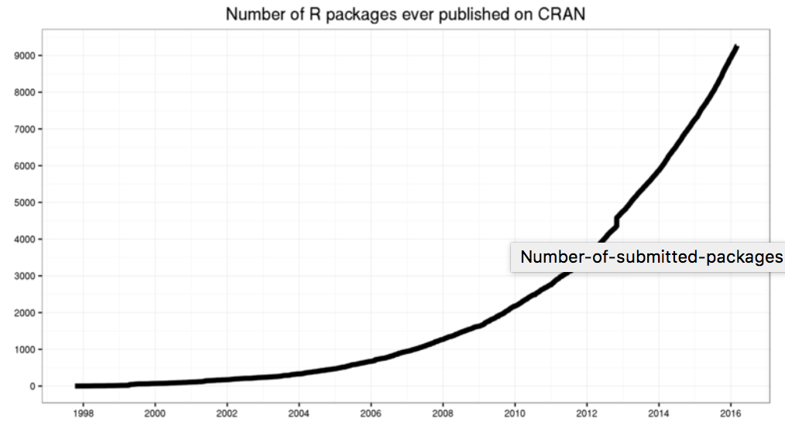
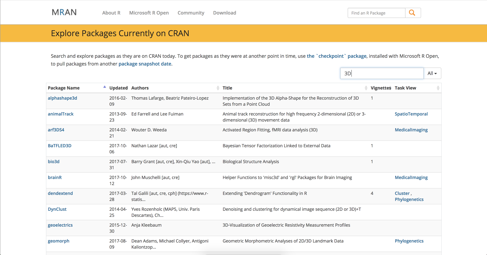

```{r setup, include=FALSE}
knitr::opts_chunk$set(echo = TRUE)
```

##### Justin Nelson - Post 01

R is commonly referred to as the undisputed best programming language for statistical analysis. This is largely in part due to its robust and useful built in functionalities, such as vectorization and coercive properties. However, what is equally important is the myriad of readily available, user created R packages. As Matt Adams put it, "The vastness of the package ecosystem is definitely one of R's strongest qualities -- if a statistical tecnique exists, odds are there's already an R package out there for it." [(InfoWorld)](https://www.infoworld.com/article/2940864/application-development/r-programming-language-statistical-data-analysis.html)

This topic is of special interest to me due to my experience with data anlysis prior to this course, specifically in Python. In Data 8, much of our analysis was done by creating our own functions to iterate over lists, calculate specific values, etc. While we would import packages from external sources from time to time, the way in which it was done was not nearly as simple or straightforward as it was in R. Additionally, the readily available and concise documentation provided for packages and functions in R makes it all the easier to use.

To offer a comprehensive overview of R's strong open source offerings, this report will contain information on the following areas:

1. Overview, History, and Development of CRAN
2. Searching CRAN & Installing Packages Accordingly
3. Utilizing Packages for Common and Useful Applications
4. Conclusion

### Overview, History, and Explanation of CRAN
CRAN, an acronym for Comprehensive R Archive Network, is R's platform where users can both upload and download packages. CRAN was announced on April 23rd, 1997 by Kurt Jornik, and the original post can be found [here](https://stat.ethz.ch/pipermail/r-announce/1997/000001.html). A package is essentially a collection of functions whose usages revolve around one general purpose. These packages are built by users and submitted to CRAN, where they are thoroughly reviewed both volunteerily by other R Users along with automated computing processes. After testing is completed, revisions made, and the functions are up to par, CRAN moderators will allow it to be added to the archive if the creator desires. However, for the package to be uploaded, the creater must agree to a set of terms and agreements that allow their work to be used freely by others. More info can be found [here](http://blog.revolutionanalytics.com/2016/03/16-years-of-r-history.html).

When base R is installed, it comes with 8 different packages. However, CRAN currently contains over 8,000 packages that are available for download. The progression of available packages throughout the years can be seen in this graph:




### Searching MRAN & Installing Packages Accordingly
While having 8,000 packages that all serve different purposes is largely advantageous, it also means that locating the packages you desire could prove difficult. Thankfully, there is MRAN. MRAN, an acronym for Microsoft Open R, "is the enhanced distribution of open source R from Microsoft Corporation". Microsoft has created a very user friendly interface and platform for navigating the CRAN database. It can be accessed by visiting [https://mran.microsoft.com/](https://mran.microsoft.com/). With fields for "Package Name", "Updated", "Title", and "Task View", along with a search bar, locating your desired package is relatively easy. For example, say I wanted a package to help me with plotting things in three dimensions. I could then go to the search bar and type in "3D". The results for packages related to 3D functionalities are displayed, and I can choose accordingly. This is documented in the picture below.


Suppose that after scanning through the various packages related to three dimensional functionalities, I come across the package "plot3d". I can then click on it, and explore the package's manual. Within the manual is  documentation of a detailed description, author, last updated, usages, etc. After exploring this, I decide to use it. As we've already learned in lecture, to install the package you use the install.packages() function that's built into R. In this case, it would look like this:
```{r}
#Use the built-in install.packages() function with the plot3D package in string form to download the package.
install.packages('plot3D', repos = "http://cran.us.r-project.org")
```
With the package now installed on your machine, you can load it and start using it with the library() function.

 
```{r}
#Use library() on the desired package to load it into the current session
library(plot3D)
```

While the installation and loading of packages is relatively simple and something we've done often in class, the important take-away from this section is how to find the specific package you're looking for. While it often may be the case that you already the name of the package you want or it is supplied to you beforehand (i.e. as it has been in class), it's important to know how to find the appropriate packages when you undertake your personal work. 

### Utilizing Packages for Common and Useful Applications
Within the extensive documentation in the manual that was mentioned earlier, there is also information about how to utilize a packages functions. Things such as arguments, best practices, and examples are provided.

To demonstrate the usefulness of packages, suppose I have two goals in mind: 
1. Graph the relationship between year, GDP in Billions of Current Dollars, and GDP in Billions of Chained 2009 Dollars to get a picture of the U.S. macro economy over the past ~80 years.
2. Analyze how a company that is currently being traded on the stock market has been performing over the past year.

#### Goal: Graphing the relationship between the three variables.
First, I'll import the dataset that I'll be working with. I found this data on the Bureau of Economic Analysis' [website](https://www.bea.gov/national/index.htm).

```{r}
#Read in the CSV file that contains the data to be analyzed
gdp <- read.csv('Data/GDP Data.csv')
```
To graph the relationship between these variables simultaneously, we'll have to use a 3D graph. Since we've already installed and loaded the plot3d package above, there is no need to load it again. From here, I can read through the documentation of plot3D until I find the type of graph I want to use.

After scanning through examples, it's apparent that a 3-D scatter plot is best, so I'll use the scatter3D function to create it.

```{r}
#Checking the columns of data to be used
gdp
#Generating a 3d scatter plot of the three variables.
scatter3D(as.numeric(gdp$GDP.Chained.2009.Dollars), as.numeric(gdp$Year), as.numeric(gdp$GDP.Current.Dollar), xlab = 'GDP 2009 Dollars', ylab = 'Year (1929-2016)', zlab = 'GDP Current Dollar', colkey = NULL, col = NULL, colvar = NULL)
```
From this graph, we can see that, in general, GDP in current dollars and GDP in 2009 chained dollars rose in unison. This did not hold true during the 1970's when the US was experiencing inflation rates that were far above standard (>10%). It's also interesting to note the stark dropoff in both forms of GDP during the early 1930's (early part of Y-axis) when the Great Depression occurred.

By utilizing the 3d functionalities available through plot3D, we're able to visualize economic trends that occurred in the United States over an 80 year period.

#### Goal: Analyzing the performance of a stock over several different time periods
Suppose I'm interested in exploring NVidia's stock a bit. To gather this data I could go onto a website that collects information on stock performance, find Nvidia, and see if there are available files in a convienant format (aka CSV) to download. But instead of that, why not see if an R package already exists to do that in a simplified fashion? 

A quick search of MRAN led me to the package "quantmod", a package that ["...is designed to assist the quantitative trader in the development, testing, and deployment of statistically based trading models."](http://www.quantmod.com/)

Let's start by downloading the package from CRAN.
```{r}
#Using install.packages() to acquire the package.
install.packages('quantmod', repos = "http://cran.us.r-project.org")
#Load the package so we can use it
library('quantmod')
```
Now that the package is loaded, let's gather some data about NVIDIA. A quick read through of the documentaiton tells us that we can use the getSymbols() function to load data about a company, and a Google search yields that Nvidia's ticker label is NVDA.

```{r}
getSymbols("NVDA",src="google") 
#Note that the getSymbols function automatically creates a data frame for the loaded data that is named by the ticker label. This means that we don't have to assign the loaded data to a variable - it's already done!
```
Let's take a quick look at a chart of this stock's performance since it's inception to gain an idea of what we're dealing with.

```{r}
#Generate a barchart of the stock's history.
barChart(NVDA)
```
That's handy, but it's nothing that we couldn't find online without relative ease.

Let's zoom in on the past year specificially.
```{r}
#Gathering data for specifically the past year.
one_yr <- NVDA['2016-10-30::']
lineChart(one_yr)
```
That's some impressive growth for a stock! How much exactly is it though?
```{r}
#Finding the closing price on October 31, 2016
close1 <- as.numeric(Cl(one_yr[1]))
#Finding the closing price on October 27th, 2017.
close2 <- as.numeric(Cl(one_yr[251]))

#Calculating total percent change over the year.
(close2 / close1) * 100
```
Once again, useful to know but something that could be found relatively easily online. Let's look at something a litle more complex that would only be easily done with this package or some other complex software.

Let's find the number of weeks over the past year that NVDA's stock went positive, and express that as a percentage as well.

```{r}
#The built in weeklyReturn function yeilds the return values for each week. 
weekly <- (weeklyReturn(one_yr))
```
Before finding the number of weeks that the stock went positive, let's take a look at it graphically:
```{r}
#Generating a line chart of the stocks weekly performance.
chartSeries(weekly)
```
Overall, this looks strong with mostly positive weeks and some negatives. Let's find the exact value of positive weeks:
```{r}
#Converting the data into numeric types so we can work with it.
weekly <- as.numeric(weekly)
#Creating a factor of booleans for when returns were postive.
positive <- weekly > 0
#Counting number of weeks were positive.
pos_weeks <- sum(positive)
#35 total positive weeks. And how about as a percentage for the entire year?
pos_weeks / length(weekly)
```
So, we found that in the past 51 weeks, there were 35 in which NVDA's stock rose (or 67.3% of the time). This is the type of data that would not be easily extractable via most finance websites.

###Conclusion
When undertaking a data analysis project in R, it is highly recommended to consult CRAN. While constructing your own functions or scouring the web for data is definitely useful in specific situations, it is highly likeley that a package already exists for the analysis you're trying to do. Packages exist for some of the most basic analysis like linear regression, to much more complex things such as Neural Network Algorithms. In addition to statistical analysis, packages are also available for manipulating data in R, which is useful for transforming or reworking data into a desired form so it can be explored further. Spend your time wisely by driving towards the conclusion you seek, not by developing work that is readily available AND free! 