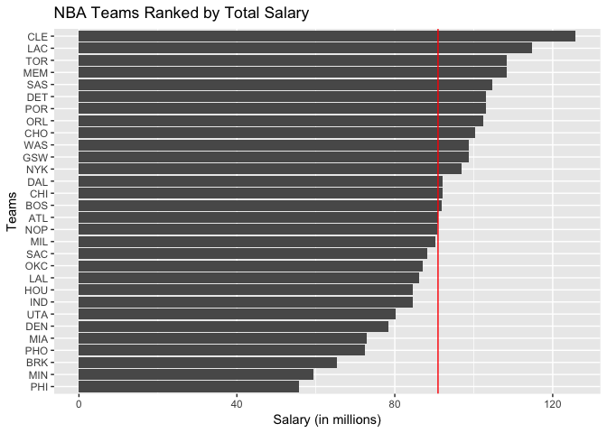
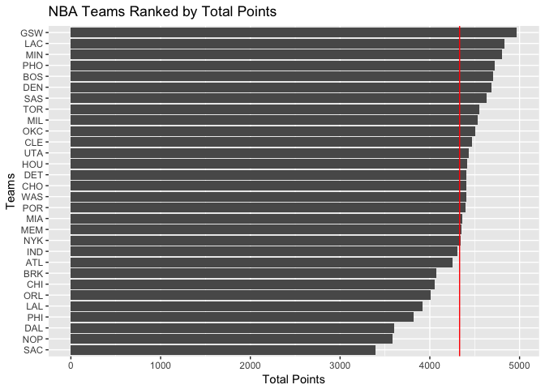
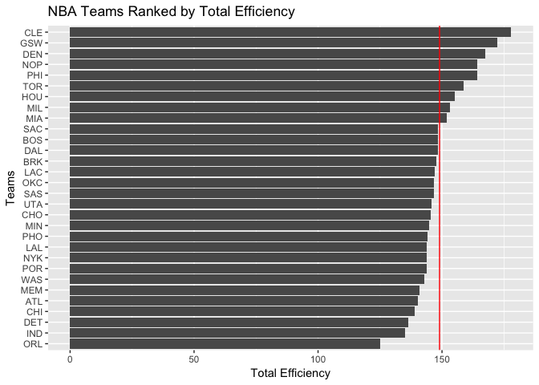
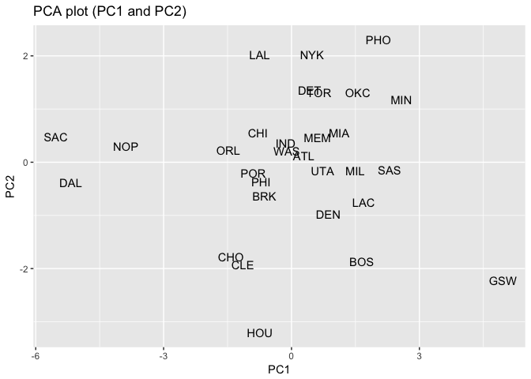
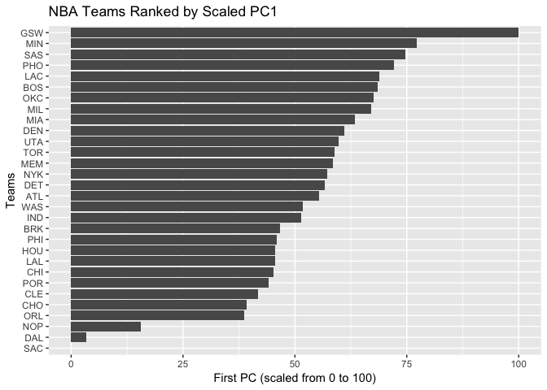

Justin Nelson - HW03
================

``` r
ranked_sal <- arrange(teams, desc(salary))
ranked_sal
```

    ##     X team experience salary points3 points2 free_throws off_rebounds
    ## 1   6  CLE        128 125.79    1012    2107        1355          727
    ## 2  13  LAC        124 114.78     841    2401        1586          740
    ## 3  28  TOR         57 108.46     626    2359        1570          848
    ## 4  15  MEM         83 108.34     750    2140        1465          866
    ## 5  27  SAS         99 104.69     743    2459        1431          821
    ## 6   9  DET         55 103.07     631    2638        1140          908
    ## 7  25  POR         43 103.03     852    2156        1386          710
    ## 8  22  ORL         57 102.41     614    2168        1230          699
    ## 9   5  CHO         66 100.25     808    2102        1499          634
    ## 10 30  WAS         56  98.78     671    2417        1316          748
    ## 11 10  GSW        101  98.69     982    2540        1447          759
    ## 12 20  NYK         59  97.01     636    2445        1262          961
    ## 13  7  DAL         62  92.10     754    1803        1042          534
    ## 14  4  CHI         58  92.08     565    2162        1330          865
    ## 15  2  BOS         63  91.92     985    2183        1536          744
    ## 16  1  ATL         93  90.89     626    2254        1373          807
    ## 17 19  NOP         55  90.63     513    1952        1120          580
    ## 18 17  MIL         64  90.27     718    2424        1388          700
    ## 19 26  SAC         68  88.19     558    1838         998          524
    ## 20 21  OKC         55  86.98     611    2380        1511          936
    ## 21 14  LAL         66  86.27     592    2249        1080          909
    ## 22 11  HOU         56  84.66    1141    1769        1508          766
    ## 23 12  IND         84  84.57     641    2331        1333          679
    ## 24 29  UTA         71  80.32     791    2242        1401          771
    ## 25  8  DEN         74  78.38     868    2347        1471          867
    ## 26 16  MIA         63  72.78     799    2349        1217          857
    ## 27 24  PHO         68  72.53     564    2551        1605          882
    ## 28  3  BRK         52  65.45     738    1950        1381          608
    ## 29 18  MIN         48  59.38     601    2623        1585          938
    ## 30 23  PHI         34  55.78     690    1917        1212          673
    ##    def_rebounds assists steals blocks turnovers fouls efficiency
    ## 1          2639    1760    475    299      1005  1318   177.8585
    ## 2          2790    1848    613    349      1024  1626   147.1242
    ## 3          2533    1469    621    379       933  1609   158.7658
    ## 4          2534    1669    612    329       973  1748   140.9707
    ## 5          2768    1926    650    485      1038  1479   146.6236
    ## 6          2838    1731    574    310       932  1467   136.3762
    ## 7          2437    1519    524    345       988  1587   143.7321
    ## 8          2435    1744    544    302       978  1432   125.1406
    ## 9          2636    1805    550    320       827  1198   145.2994
    ## 10         2393    1861    605    314      1017  1465   143.0117
    ## 11         2854    2475    779    551      1171  1565   172.3916
    ## 12         2591    1499    526    451       975  1584   143.9033
    ## 13         2109    1291    538    266       703  1280   148.2243
    ## 14         2416    1746    605    339       952  1275   139.1025
    ## 15         2698    2069    617    341      1037  1686   148.2525
    ## 16         2537    1784    601    354      1136  1329   140.3269
    ## 17         2244    1523    497    380       823  1164   164.2521
    ## 18         2541    1953    651    422      1064  1601   153.2588
    ## 19         1878    1394    503    234       847  1302   148.3954
    ## 20         2628    1610    595    394      1133  1561   146.8680
    ## 21         2462    1430    593    307      1028  1593   143.9768
    ## 22         2429    1906    564    292      1046  1314   155.1031
    ## 23         2436    1713    612    391       996  1490   135.0697
    ## 24         2774    1651    550    410      1061  1545   145.8193
    ## 25         2646    2009    538    285      1097  1458   167.3595
    ## 26         2649    1728    577    464      1019  1647   151.9902
    ## 27         2456    1530    587    385      1171  1886   144.3065
    ## 28         2546    1593    547    372      1152  1522   147.7823
    ## 29         2530    1934    652    370      1095  1644   144.8383
    ## 30         2282    1788    599    369      1184  1516   164.0916
    ##    points_total
    ## 1          4474
    ## 2          4828
    ## 3          4555
    ## 4          4355
    ## 5          4633
    ## 6          4409
    ## 7          4394
    ## 8          4012
    ## 9          4409
    ## 10         4404
    ## 11         4969
    ## 12         4343
    ## 13         3599
    ## 14         4057
    ## 15         4704
    ## 16         4253
    ## 17         3585
    ## 18         4530
    ## 19         3394
    ## 20         4502
    ## 21         3921
    ## 22         4418
    ## 23         4305
    ## 24         4434
    ## 25         4686
    ## 26         4365
    ## 27         4720
    ## 28         4069
    ## 29         4809
    ## 30         3819

``` r
mean_sal <- mean(ranked_sal$salary)
mean_sal
```

    ## [1] 90.94933

``` r
help(reorder)
ggplot(ranked_sal, aes(x = reorder(team, salary), y = salary)) + geom_bar(stat = 'identity') + coord_flip() + ggtitle('NBA Teams Ranked by Total Salary') + geom_hline(yintercept = mean_sal, col = 'red') + xlab('Teams') + ylab('Salary (in millions)')
```

 Cleveland has the highest total salary standing at just a bit above 120 million last season, while Philadelphia sits in last with around 60 million, which is less than half of what Cleveland is playing. About 5 teams fall directly on the average, and the rest are about evenly distributed on either side of the average.

``` r
ranked_points <- teams %>%
  arrange(desc(points_total))
ranked_points
```

    ##     X team experience salary points3 points2 free_throws off_rebounds
    ## 1  10  GSW        101  98.69     982    2540        1447          759
    ## 2  13  LAC        124 114.78     841    2401        1586          740
    ## 3  18  MIN         48  59.38     601    2623        1585          938
    ## 4  24  PHO         68  72.53     564    2551        1605          882
    ## 5   2  BOS         63  91.92     985    2183        1536          744
    ## 6   8  DEN         74  78.38     868    2347        1471          867
    ## 7  27  SAS         99 104.69     743    2459        1431          821
    ## 8  28  TOR         57 108.46     626    2359        1570          848
    ## 9  17  MIL         64  90.27     718    2424        1388          700
    ## 10 21  OKC         55  86.98     611    2380        1511          936
    ## 11  6  CLE        128 125.79    1012    2107        1355          727
    ## 12 29  UTA         71  80.32     791    2242        1401          771
    ## 13 11  HOU         56  84.66    1141    1769        1508          766
    ## 14  5  CHO         66 100.25     808    2102        1499          634
    ## 15  9  DET         55 103.07     631    2638        1140          908
    ## 16 30  WAS         56  98.78     671    2417        1316          748
    ## 17 25  POR         43 103.03     852    2156        1386          710
    ## 18 16  MIA         63  72.78     799    2349        1217          857
    ## 19 15  MEM         83 108.34     750    2140        1465          866
    ## 20 20  NYK         59  97.01     636    2445        1262          961
    ## 21 12  IND         84  84.57     641    2331        1333          679
    ## 22  1  ATL         93  90.89     626    2254        1373          807
    ## 23  3  BRK         52  65.45     738    1950        1381          608
    ## 24  4  CHI         58  92.08     565    2162        1330          865
    ## 25 22  ORL         57 102.41     614    2168        1230          699
    ## 26 14  LAL         66  86.27     592    2249        1080          909
    ## 27 23  PHI         34  55.78     690    1917        1212          673
    ## 28  7  DAL         62  92.10     754    1803        1042          534
    ## 29 19  NOP         55  90.63     513    1952        1120          580
    ## 30 26  SAC         68  88.19     558    1838         998          524
    ##    def_rebounds assists steals blocks turnovers fouls efficiency
    ## 1          2854    2475    779    551      1171  1565   172.3916
    ## 2          2790    1848    613    349      1024  1626   147.1242
    ## 3          2530    1934    652    370      1095  1644   144.8383
    ## 4          2456    1530    587    385      1171  1886   144.3065
    ## 5          2698    2069    617    341      1037  1686   148.2525
    ## 6          2646    2009    538    285      1097  1458   167.3595
    ## 7          2768    1926    650    485      1038  1479   146.6236
    ## 8          2533    1469    621    379       933  1609   158.7658
    ## 9          2541    1953    651    422      1064  1601   153.2588
    ## 10         2628    1610    595    394      1133  1561   146.8680
    ## 11         2639    1760    475    299      1005  1318   177.8585
    ## 12         2774    1651    550    410      1061  1545   145.8193
    ## 13         2429    1906    564    292      1046  1314   155.1031
    ## 14         2636    1805    550    320       827  1198   145.2994
    ## 15         2838    1731    574    310       932  1467   136.3762
    ## 16         2393    1861    605    314      1017  1465   143.0117
    ## 17         2437    1519    524    345       988  1587   143.7321
    ## 18         2649    1728    577    464      1019  1647   151.9902
    ## 19         2534    1669    612    329       973  1748   140.9707
    ## 20         2591    1499    526    451       975  1584   143.9033
    ## 21         2436    1713    612    391       996  1490   135.0697
    ## 22         2537    1784    601    354      1136  1329   140.3269
    ## 23         2546    1593    547    372      1152  1522   147.7823
    ## 24         2416    1746    605    339       952  1275   139.1025
    ## 25         2435    1744    544    302       978  1432   125.1406
    ## 26         2462    1430    593    307      1028  1593   143.9768
    ## 27         2282    1788    599    369      1184  1516   164.0916
    ## 28         2109    1291    538    266       703  1280   148.2243
    ## 29         2244    1523    497    380       823  1164   164.2521
    ## 30         1878    1394    503    234       847  1302   148.3954
    ##    points_total
    ## 1          4969
    ## 2          4828
    ## 3          4809
    ## 4          4720
    ## 5          4704
    ## 6          4686
    ## 7          4633
    ## 8          4555
    ## 9          4530
    ## 10         4502
    ## 11         4474
    ## 12         4434
    ## 13         4418
    ## 14         4409
    ## 15         4409
    ## 16         4404
    ## 17         4394
    ## 18         4365
    ## 19         4355
    ## 20         4343
    ## 21         4305
    ## 22         4253
    ## 23         4069
    ## 24         4057
    ## 25         4012
    ## 26         3921
    ## 27         3819
    ## 28         3599
    ## 29         3585
    ## 30         3394

``` r
mean_points <- mean(ranked_points$points_total)
mean_points
```

    ## [1] 4331.833

``` r
ggplot(ranked_points, aes(x = reorder(team, points_total), y = points_total)) + geom_bar(stat = 'identity') + coord_flip() + ggtitle('NBA Teams Ranked by Total Points') + geom_hline(yintercept = mean_points, col = 'red') + xlab('Teams') + ylab('Total Points')
```

 The rankings of total points does not very nearly as much as total salary paid out. Most teams fall somewhat close within average, exlucing a few outliers on either end of the spectrum. This makes sense because most games aren't huge blowouts, and even when the worst team plays the best team, the bad team will still be putting up points.

``` r
ranked_eff <- arrange(teams, desc(efficiency))
ranked_eff
```

    ##     X team experience salary points3 points2 free_throws off_rebounds
    ## 1   6  CLE        128 125.79    1012    2107        1355          727
    ## 2  10  GSW        101  98.69     982    2540        1447          759
    ## 3   8  DEN         74  78.38     868    2347        1471          867
    ## 4  19  NOP         55  90.63     513    1952        1120          580
    ## 5  23  PHI         34  55.78     690    1917        1212          673
    ## 6  28  TOR         57 108.46     626    2359        1570          848
    ## 7  11  HOU         56  84.66    1141    1769        1508          766
    ## 8  17  MIL         64  90.27     718    2424        1388          700
    ## 9  16  MIA         63  72.78     799    2349        1217          857
    ## 10 26  SAC         68  88.19     558    1838         998          524
    ## 11  2  BOS         63  91.92     985    2183        1536          744
    ## 12  7  DAL         62  92.10     754    1803        1042          534
    ## 13  3  BRK         52  65.45     738    1950        1381          608
    ## 14 13  LAC        124 114.78     841    2401        1586          740
    ## 15 21  OKC         55  86.98     611    2380        1511          936
    ## 16 27  SAS         99 104.69     743    2459        1431          821
    ## 17 29  UTA         71  80.32     791    2242        1401          771
    ## 18  5  CHO         66 100.25     808    2102        1499          634
    ## 19 18  MIN         48  59.38     601    2623        1585          938
    ## 20 24  PHO         68  72.53     564    2551        1605          882
    ## 21 14  LAL         66  86.27     592    2249        1080          909
    ## 22 20  NYK         59  97.01     636    2445        1262          961
    ## 23 25  POR         43 103.03     852    2156        1386          710
    ## 24 30  WAS         56  98.78     671    2417        1316          748
    ## 25 15  MEM         83 108.34     750    2140        1465          866
    ## 26  1  ATL         93  90.89     626    2254        1373          807
    ## 27  4  CHI         58  92.08     565    2162        1330          865
    ## 28  9  DET         55 103.07     631    2638        1140          908
    ## 29 12  IND         84  84.57     641    2331        1333          679
    ## 30 22  ORL         57 102.41     614    2168        1230          699
    ##    def_rebounds assists steals blocks turnovers fouls efficiency
    ## 1          2639    1760    475    299      1005  1318   177.8585
    ## 2          2854    2475    779    551      1171  1565   172.3916
    ## 3          2646    2009    538    285      1097  1458   167.3595
    ## 4          2244    1523    497    380       823  1164   164.2521
    ## 5          2282    1788    599    369      1184  1516   164.0916
    ## 6          2533    1469    621    379       933  1609   158.7658
    ## 7          2429    1906    564    292      1046  1314   155.1031
    ## 8          2541    1953    651    422      1064  1601   153.2588
    ## 9          2649    1728    577    464      1019  1647   151.9902
    ## 10         1878    1394    503    234       847  1302   148.3954
    ## 11         2698    2069    617    341      1037  1686   148.2525
    ## 12         2109    1291    538    266       703  1280   148.2243
    ## 13         2546    1593    547    372      1152  1522   147.7823
    ## 14         2790    1848    613    349      1024  1626   147.1242
    ## 15         2628    1610    595    394      1133  1561   146.8680
    ## 16         2768    1926    650    485      1038  1479   146.6236
    ## 17         2774    1651    550    410      1061  1545   145.8193
    ## 18         2636    1805    550    320       827  1198   145.2994
    ## 19         2530    1934    652    370      1095  1644   144.8383
    ## 20         2456    1530    587    385      1171  1886   144.3065
    ## 21         2462    1430    593    307      1028  1593   143.9768
    ## 22         2591    1499    526    451       975  1584   143.9033
    ## 23         2437    1519    524    345       988  1587   143.7321
    ## 24         2393    1861    605    314      1017  1465   143.0117
    ## 25         2534    1669    612    329       973  1748   140.9707
    ## 26         2537    1784    601    354      1136  1329   140.3269
    ## 27         2416    1746    605    339       952  1275   139.1025
    ## 28         2838    1731    574    310       932  1467   136.3762
    ## 29         2436    1713    612    391       996  1490   135.0697
    ## 30         2435    1744    544    302       978  1432   125.1406
    ##    points_total
    ## 1          4474
    ## 2          4969
    ## 3          4686
    ## 4          3585
    ## 5          3819
    ## 6          4555
    ## 7          4418
    ## 8          4530
    ## 9          4365
    ## 10         3394
    ## 11         4704
    ## 12         3599
    ## 13         4069
    ## 14         4828
    ## 15         4502
    ## 16         4633
    ## 17         4434
    ## 18         4409
    ## 19         4809
    ## 20         4720
    ## 21         3921
    ## 22         4343
    ## 23         4394
    ## 24         4404
    ## 25         4355
    ## 26         4253
    ## 27         4057
    ## 28         4409
    ## 29         4305
    ## 30         4012

``` r
mean_eff <- mean(ranked_eff$efficiency)
mean_eff
```

    ## [1] 149.0072

``` r
ggplot(ranked_eff, aes(x = reorder(team, efficiency), y = efficiency)) + geom_bar(stat = 'identity') + coord_flip() + ggtitle('NBA Teams Ranked by Total Efficiency') + geom_hline(yintercept = mean_eff, col = 'red') + xlab('Teams') + ylab('Total Efficiency')
```

 Similar to the total points ranking, there is not as much variance in this ranking scale as there was in total salary. Most teams fall close to average. This also makes sense for a similar reason as it did for total points - all players in the NBA are going to be relatively 'efficient', otherwise they wouldn't be in the NBA. It's the slight differences in people's efficiencies that generate the large differences in salaries paid.

``` r
help(princomp)
pca_vars <- teams %>%
  select(points3, points2, free_throws, off_rebounds, def_rebounds, assists, steals, blocks, turnovers, fouls)
pca_vars
```

    ##    points3 points2 free_throws off_rebounds def_rebounds assists steals
    ## 1      626    2254        1373          807         2537    1784    601
    ## 2      985    2183        1536          744         2698    2069    617
    ## 3      738    1950        1381          608         2546    1593    547
    ## 4      565    2162        1330          865         2416    1746    605
    ## 5      808    2102        1499          634         2636    1805    550
    ## 6     1012    2107        1355          727         2639    1760    475
    ## 7      754    1803        1042          534         2109    1291    538
    ## 8      868    2347        1471          867         2646    2009    538
    ## 9      631    2638        1140          908         2838    1731    574
    ## 10     982    2540        1447          759         2854    2475    779
    ## 11    1141    1769        1508          766         2429    1906    564
    ## 12     641    2331        1333          679         2436    1713    612
    ## 13     841    2401        1586          740         2790    1848    613
    ## 14     592    2249        1080          909         2462    1430    593
    ## 15     750    2140        1465          866         2534    1669    612
    ## 16     799    2349        1217          857         2649    1728    577
    ## 17     718    2424        1388          700         2541    1953    651
    ## 18     601    2623        1585          938         2530    1934    652
    ## 19     513    1952        1120          580         2244    1523    497
    ## 20     636    2445        1262          961         2591    1499    526
    ## 21     611    2380        1511          936         2628    1610    595
    ## 22     614    2168        1230          699         2435    1744    544
    ## 23     690    1917        1212          673         2282    1788    599
    ## 24     564    2551        1605          882         2456    1530    587
    ## 25     852    2156        1386          710         2437    1519    524
    ## 26     558    1838         998          524         1878    1394    503
    ## 27     743    2459        1431          821         2768    1926    650
    ## 28     626    2359        1570          848         2533    1469    621
    ## 29     791    2242        1401          771         2774    1651    550
    ## 30     671    2417        1316          748         2393    1861    605
    ##    blocks turnovers fouls
    ## 1     354      1136  1329
    ## 2     341      1037  1686
    ## 3     372      1152  1522
    ## 4     339       952  1275
    ## 5     320       827  1198
    ## 6     299      1005  1318
    ## 7     266       703  1280
    ## 8     285      1097  1458
    ## 9     310       932  1467
    ## 10    551      1171  1565
    ## 11    292      1046  1314
    ## 12    391       996  1490
    ## 13    349      1024  1626
    ## 14    307      1028  1593
    ## 15    329       973  1748
    ## 16    464      1019  1647
    ## 17    422      1064  1601
    ## 18    370      1095  1644
    ## 19    380       823  1164
    ## 20    451       975  1584
    ## 21    394      1133  1561
    ## 22    302       978  1432
    ## 23    369      1184  1516
    ## 24    385      1171  1886
    ## 25    345       988  1587
    ## 26    234       847  1302
    ## 27    485      1038  1479
    ## 28    379       933  1609
    ## 29    410      1061  1545
    ## 30    314      1017  1465

``` r
pca <- prcomp(x = pca_vars, scale. = TRUE)
names(pca)
```

    ## [1] "sdev"     "rotation" "center"   "scale"    "x"

``` r
ev <- pca$sdev ^ 2
props <- ev / sum(ev)
cumprop <- cumsum(props)

eigenvals <- data.frame(ev, props, cumprop)
eigenvals
```

    ##            ev       props   cumprop
    ## 1  4.69588631 0.469588631 0.4695886
    ## 2  1.70201009 0.170201009 0.6397896
    ## 3  0.97952464 0.097952464 0.7377421
    ## 4  0.77171938 0.077171938 0.8149140
    ## 5  0.53408824 0.053408824 0.8683229
    ## 6  0.47801622 0.047801622 0.9161245
    ## 7  0.38220374 0.038220374 0.9543449
    ## 8  0.26026243 0.026026243 0.9803711
    ## 9  0.13359274 0.013359274 0.9937304
    ## 10 0.06269622 0.006269622 1.0000000

``` r
PC1 <- pca$x[1:30]
PC2 <- pca$x[31:60]

plot_frame <- data.frame(PC1, PC2, teams = teams$team)
plot_frame
```

    ##           PC1        PC2 teams
    ## 1   0.2883171  0.1281265   ATL
    ## 2   1.6475677 -1.8678932   BOS
    ## 3  -0.6378694 -0.6410895   BRK
    ## 4  -0.7889514  0.5491124   CHI
    ## 5  -1.4213891 -1.7716179   CHO
    ## 6  -1.1429197 -1.9254795   CLE
    ## 7  -5.1770470 -0.3771922   DAL
    ## 8   0.8628216 -0.9755539   DEN
    ## 9   0.4228059  1.3520635   DET
    ## 10  4.9580722 -2.2173199   GSW
    ## 11 -0.7434842 -3.2031420   HOU
    ## 12 -0.1393098  0.3561238   IND
    ## 13  1.6926408 -0.7550453   LAC
    ## 14 -0.7449230  2.0200116   LAL
    ## 15  0.6071090  0.4667924   MEM
    ## 16  1.1154708  0.5570744   MIA
    ## 17  1.4939629 -0.1637954   MIL
    ## 18  2.5754284  1.1769429   MIN
    ## 19 -3.8867632  0.3023898   NOP
    ## 20  0.4804728  2.0259452   NYK
    ## 21  1.5554071  1.3170619   OKC
    ## 22 -1.4831168  0.2204544   ORL
    ## 23 -0.7149664 -0.3641317   PHI
    ## 24  2.0387934  2.2997473   PHO
    ## 25 -0.8965058 -0.2071566   POR
    ## 26 -5.5291364  0.4742780   SAC
    ## 27  2.2990719 -0.1427248   SAS
    ## 28  0.6469827  1.3120040   TOR
    ## 29  0.7307586 -0.1550934   UTA
    ## 30 -0.1093009  0.2091070   WAS

``` r
ggplot(plot_frame, aes(PC1, PC2)) + geom_point(alpha = .01) + geom_text(aes(label = teams)) + ggtitle('PCA plot (PC1 and PC2)')
```



``` r
PC1_new <- 100 * ((PC1 - min(PC1)) / (max(PC1) - min(PC1)))
PC1_new
```

    ##  [1]  55.471897  68.432930  46.640314  45.199683  39.169120  41.824445
    ##  [7]   3.357322  60.950042  56.754305 100.000000  45.633232  51.394292
    ## [13]  68.862721  45.619512  58.511713  63.359160  66.968243  77.280477
    ## [19]  15.660728  57.304183  67.554140  38.580520  45.905162  72.163434
    ## [25]  44.174106   0.000000  74.645300  58.891926  59.690765  51.680440

``` r
bar_df <- data.frame('PC1 New' = PC1_new, teams = teams$team)
bar_df
```

    ##       PC1.New teams
    ## 1   55.471897   ATL
    ## 2   68.432930   BOS
    ## 3   46.640314   BRK
    ## 4   45.199683   CHI
    ## 5   39.169120   CHO
    ## 6   41.824445   CLE
    ## 7    3.357322   DAL
    ## 8   60.950042   DEN
    ## 9   56.754305   DET
    ## 10 100.000000   GSW
    ## 11  45.633232   HOU
    ## 12  51.394292   IND
    ## 13  68.862721   LAC
    ## 14  45.619512   LAL
    ## 15  58.511713   MEM
    ## 16  63.359160   MIA
    ## 17  66.968243   MIL
    ## 18  77.280477   MIN
    ## 19  15.660728   NOP
    ## 20  57.304183   NYK
    ## 21  67.554140   OKC
    ## 22  38.580520   ORL
    ## 23  45.905162   PHI
    ## 24  72.163434   PHO
    ## 25  44.174106   POR
    ## 26   0.000000   SAC
    ## 27  74.645300   SAS
    ## 28  58.891926   TOR
    ## 29  59.690765   UTA
    ## 30  51.680440   WAS

``` r
mean_pc <- mean(PC1_new)
mean_pc
```

    ## [1] 52.72267

``` r
ggplot(bar_df, aes(x = reorder(teams, PC1_new), y = PC1_new)) + geom_bar(stat = 'identity') + coord_flip() + ggtitle('NBA Teams Ranked by Scaled PC1') + xlab('Teams') + ylab('First PC (scaled from 0 to 100)')
```

 According to this PC1 index that we're using to rank teams, Golden State has by far and away the highest ranking, standing at nearly 1/4 above the next closest team (Minnesota). This scaled PC differs greatly in results from something like the teams based on salary, where a team like Philadelphia was ranked at the bottom, but in this ranking they're closer to the middle.
